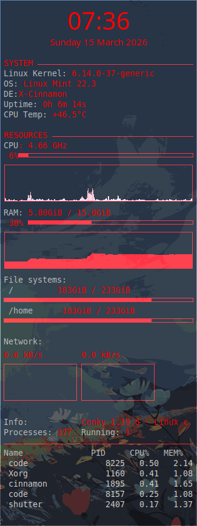

# chrono

My personal Linux dotfiles repository and automated setup tool designed to instantly deploy a fully customized i3 window manager environment. It seamlessly manages system configurations and UI themes via smart symlinks for easy replication across machines.

Currently built for: Ubuntu / Linux Mint (Arch Linux migration planned)

## Installation

```bash
git clone [https://github.com/peanutbutterchicken/chrono.git](https://github.com/peanutbutterchicken/chrono.git)
cd chrono
chmod +x setup.sh
./setup.sh
```

<br>

# (unused)Conky Workspace Look
Here’s a preview of my Conky setup on my workspace.

## Workspace layout


## Conky Appearance

